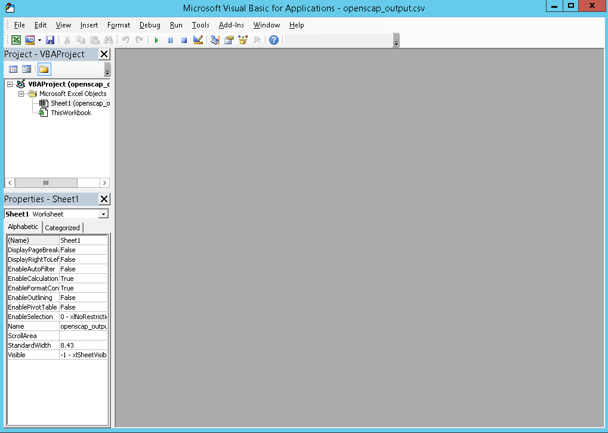
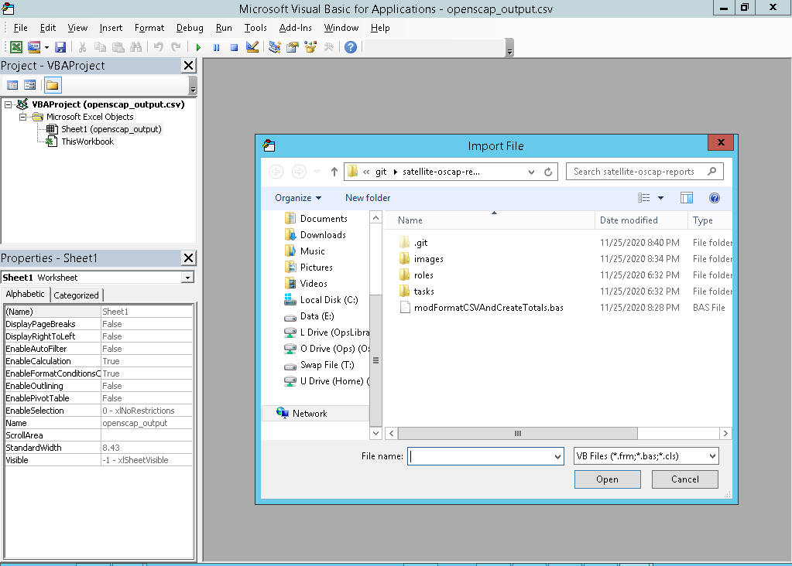
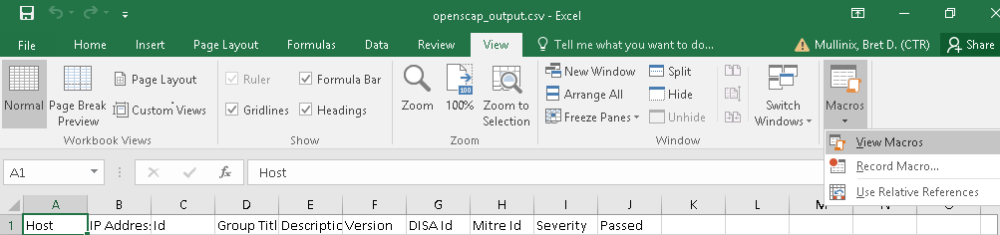

# README for satellite-oscap-reports

## How to generate a .csv file from the latest OpenSCAP file from every host on the Satellite server

## Prerequisite
   
1. You must a private-key exchanged from the management server to the satellite server
   
    Test the password less login:
   
    1. Login as yourself to the management server.
    1. SSH into the Satellite server as yourself.
    1. You should not be prompted for a password.
    1. Logout of the Satellite server.

1. You must have **bunzip2** installed on the ansible host machine.

## Procedure

1. In the **inventory** file, make sure you specify your Satellite server.

1. In the **playbook.yml** file, make sure you change the value of the variable **ansible_ssh_user** to
   the user name running the playbook.

1. In the **playbook.yml** file, the variable called **max_file_size_mb** must be set to a maximum size to parse
   the Satellite OpenSCAP XML.  All but one of the reports used to test the **report_parsing_role** were under 10 MB
   and were successfully parsed.  When setting this value, care should be taken when setting the value 
   higher than 50 MB. The Python implementation must load the entire file into memory in order to parse the file.   Eventually, the Python implementation will be changed to use a SAX or streaming approach for parsing to not load the entire file into memory and accomodate larger files sizes.

1. To run the playbook against Satellite, run the following command `ansible-playbook -i inventory playbook.yml`

1. If you want to run a playbook on just one file locally, run the following comand:
   `ansible-playbook run_against_an_existing_OpenSCAP_report_playbook.yml`.  You will need to change the variable
   **openscap_input_xml_file** value to point to your xml file.

## The Output

Inside the **files/oscap_output** folder, the csv called **openscap_output.csv** will be generated.  This file
contains all the Satellite OpenSCAP reports for all hosts listed on the server.  The **Id** column reports 
the following:

   1. If a host OpenSCAP report is parsable, the **Rule Id** is entered in this column.

   1. If a host does not have an OpenSCAP report, a message is entered in this column indicating so.

   1. If a host OpenSCAP report is over the max file size, a message is entered in this column indicating
      the failure to parse the report and the report size in MB.  
	 
## Bring the output into Excel, Format the Data, and Generate a Pivot Table for the Totals

**NOTE: The macro will not work if you change the column labels in the spreadsheet.
  Please wait until after you run the macro to change the column labels.  Also, the column labels must exist
  in the columns A-J.**

1. Open up the **openscap_output.csv** in Excel.

1. Open up the VBA developer window by pressing "Fn+Alt+F11" or "Alt+F11".  The following screen should appear.

    

1. Right click the text **Sheet1 (openscap_output)** on the left **Project - VBAProject** window.

1. A context menu should appear.  Select the **Import File** menu item.  The following screen appears.

    

1. Navigate to the location of the **modFormatCSVAndCreateTotals.bas** file.

1. Select the file and click the **Open** button.

1. Close the VBA window by clicking the **X** at the top right of the window.

1. You should now be back on the **openscap_output** worksheet.

1. As is seen below, go to the **View** tab, then select the drop down by the **Macros** button and select 
   **View Macros**.

    

1. In the dialog that appears, select the **Run** button.  The macro should format your csv, rename the
   **openscap_output** worksheet to **Data**, create a worksheet called **Totals**, and generate a pivot
   table for the totals.

